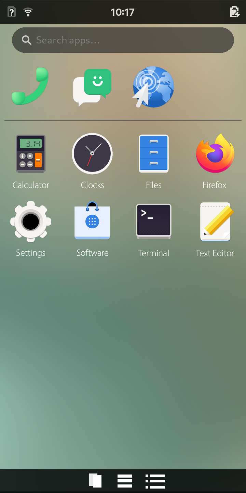
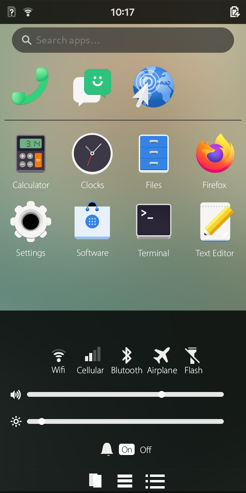
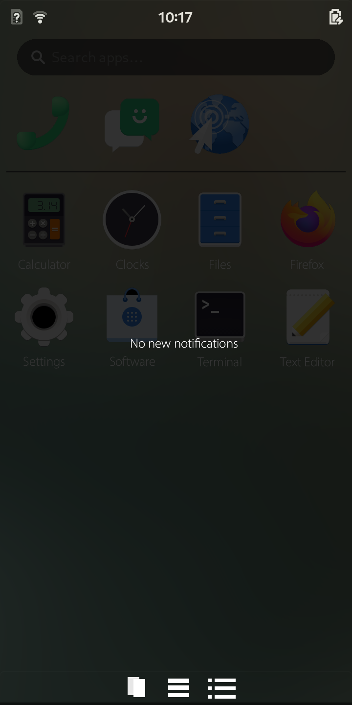
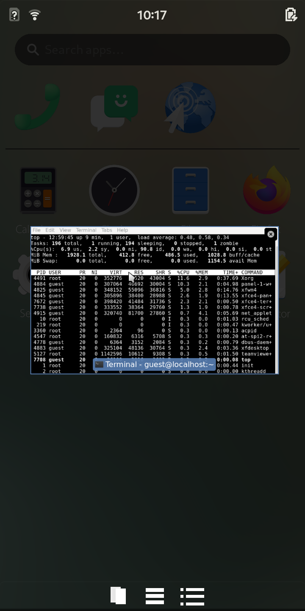

# Tuna

A mobile UI for xfce

Tuna is a community project that brings a mobile interface to xfce.
It is based on Phosh but it is lighter, more customizable, and not its own DE it will require xfce to be installed for it to work.
If you want to contribute code to the project feel free I'll accept most or all of the changes submitted

How to submit code
1.Fork tuna
2.create pull request
3.commit your changes
4.wait tell accepted

Working towards version 1.0

Here are some concepts for what I hope Tuna will look like at version 1.0

# Top contributors

-Gusaroo
