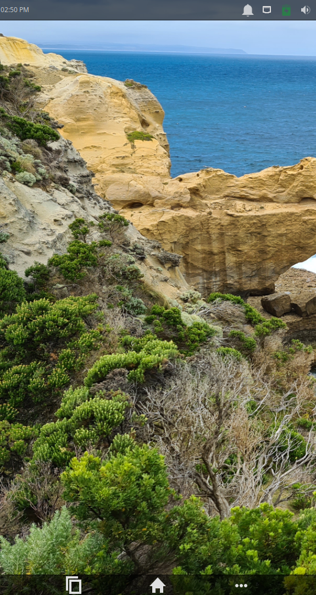
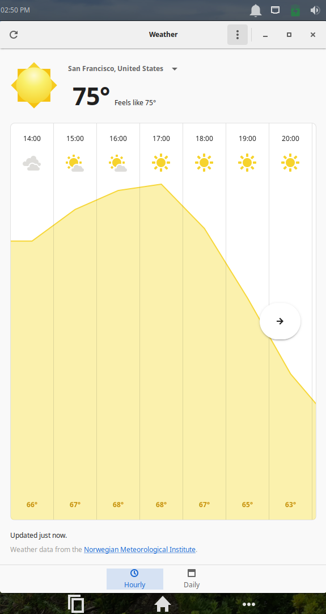
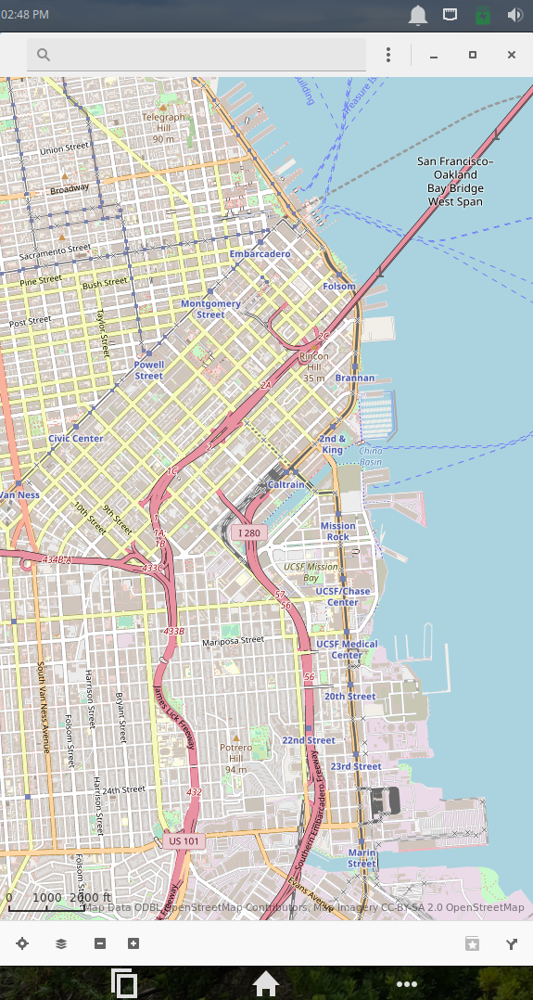

# Tuna

Tuna is a community project that brings a mobile interface to xfce.

# Releases

We're working towards 1.0 and currently on 0.2. 0.3 is set to release by September.

Big changes planned for 0.3

-Control center (Similar to what is found on iOS)

-A settings app

# Recommended apps

Here's a few apps we recommend you use Tuna with

-Onboard (Onscreen keyboard)

-Waydroid (Run android apps on Linux)

-Firefox (You know what it is)

-Geary (Email client)

-Gnome Photos (Photo manager)

